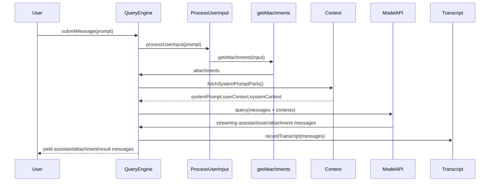

# QueryEngine — lifecycle and responsibilities

This file explains `src/QueryEngine.ts` and how it manages turns, messages, persistence, tool permission checks, and compaction.

## Contract (short)

- Input: a prompt (string or content blocks), tool context, app state accessors, readFile cache, model and prompt configuration.
- Output: an async generator yielding SDK-style messages (assistant/user/attachment/system/result/stream events).
- Error modes: emits `result` messages with `subtype` error codes (error_max_turns, error_max_budget_usd, error_during_execution, etc.) and tracks permission denials for SDK reporting.
- Success: yields assistant content blocks plus a final `result` success message with usage and cost.

## Main responsibilities

1. Manage per-conversation mutable messages
   - `this.mutableMessages` holds the conversation as an array of `Message` objects.
   - New messages from `processUserInput()` are pushed before `query()`.
   - Assistant/user/progress/attachment messages from `query()` are appended and recorded.

2. Persist transcripts
   - Uses `recordTranscript()` (see `src/utils/sessionStorage.ts`) to write messages to disk for resume.
   - Writes at key points: after user message acceptance and after assistant messages (fire-and-forget for assistant messages).
   - Honors `isSessionPersistenceDisabled()` to skip persistence.

3. Assemble system prompt and user context
   - Calls `fetchSystemPromptParts()` which uses `src/context.ts` to get memoized system and user contexts.
   - Injects memory-mechanics prompt when configured and other extras (appendSystemPrompt).

4. Handle tool permissions and track denials
   - Wraps `canUseTool` with a tracking wrapper that records denials into `this.permissionDenials` for SDK reporting.

5. Attachments and nested memory
   - Builds `toolUseContext` passed into `processUserInput()` which includes `nestedMemoryAttachmentTriggers` and `loadedNestedMemoryPaths` for nested CLAUDE.md loading.
   - `getAttachments()` performs concurrent attachment generation (file reads, nested memory discovery, queued commands, skill listings).

6. Streaming and usage accounting
   - Listens to `stream_event` messages from the API to accumulate `currentMessageUsage` and incorporates into `this.totalUsage`.
   - Tracks `lastStopReason` from message deltas to surface correct stop reasons in results.

7. Compaction and snip boundaries
   - Receives `system` messages of subtype `compact_boundary` and prunes `mutableMessages` and local `messages` arrays to release earlier messages for GC.
   - Optionally receives an injected `snipReplay` callback (feature-gated) to replay/reconstruct compacted messages.

8. Result and error reporting
   - At the end of the query loop yields a `result` SDK message summarizing duration, cost, usage, permission denials, and optionally structured output from tools.

## Important implementation notes

- `mutableMessages` is the canonical in-memory store; writes to transcript happen asynchronously to avoid blocking streaming.
- `readFileState` is used to deduplicate memory/file reads across turns. The engine sets `readFileState` back to caller via `ask()` wrapper (`setReadFileCache`) on completion.
- The engine integrates many helpers (skills, plugin cache-only loader, fetchSystemPromptParts) but isolates feature-gated strings behind conditional requires to allow dead-code elimination.

## Sequence diagram (mermaid)

## Edge cases handled

- Interrupted turns: aborts via `interrupt()` (abort controller) and generator cleanup.
- Budget and turn limits: `maxBudgetUsd` and `maxTurns` produce early error results and flush session storage.
- Structured output retries: tracks SyntheticOutput tool calls and enforces retry limits with error_max_structured_output_retries.
- Mode variations: interactive CLI/REPL paths differ in how transcripts are flushed; QueryEngine is used by SDK/headless code paths.

## Files to inspect

- `src/QueryEngine.ts`
- `src/utils/sessionStorage.ts`
- `src/utils/queryContext.ts`
- `src/utils/queryHelpers.ts`
- `src/utils/messages/*.ts`

