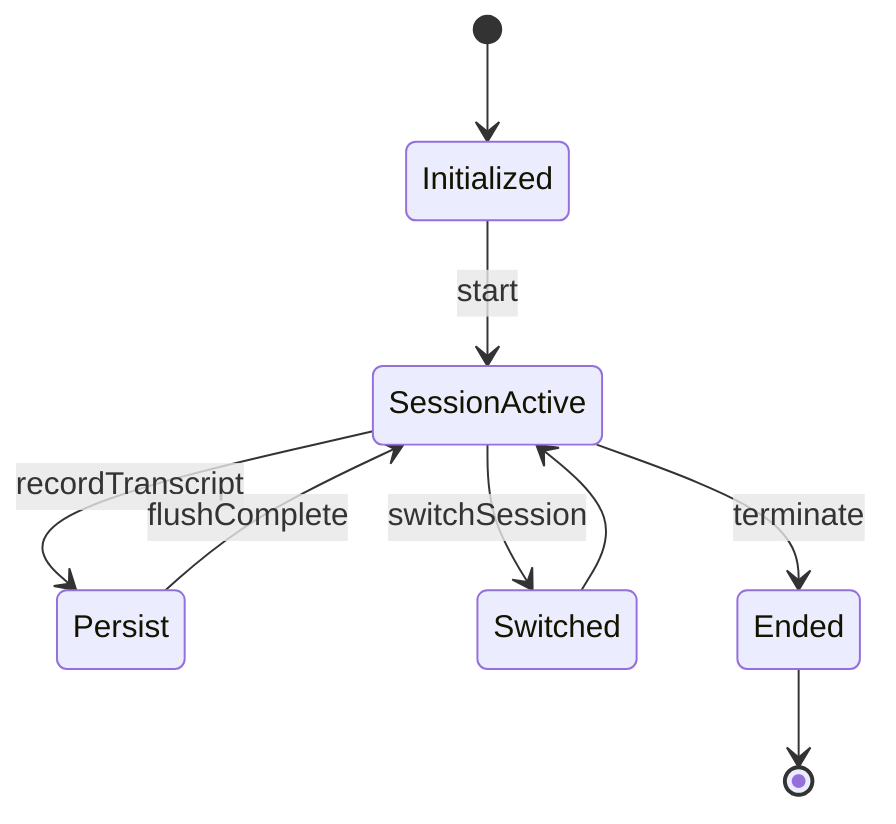

# Session and State — session lifecycle, persistence, and global state

This document describes how a session is represented, how session IDs, transcripts, and runtime state are managed.

## bootstrap/state.ts (single-process runtime state)

- `STATE` is an in-memory singleton containing:
  - `sessionId` (UUID), `parentSessionId`
  - cost & usage counters (totalCostUSD, totalAPIDuration, modelUsage)
  - telemetry handles (meter, counters), logger providers
  - runtime flags (isInteractive, sessionPersistenceDisabled)
  - `readFileState` is stored elsewhere but `STATE` coordinates session-level flags
  - `invokedSkills`, `planSlugCache`, `sessionCronTasks`, `sessionCreatedTeams`, etc.

- Key functions:
  - `getSessionId()`, `regenerateSessionId()`, `switchSession(sessionId, projectDir)` — control active session.
  - `isSessionPersistenceDisabled()` — if true, `QueryEngine` avoids persisting transcripts.
  - `setSessionPersistenceDisabled()` toggles it for special runs.

## Transcripts & history

- Transcripts are recorded via `recordTranscript()` and `flushSessionStorage()` in `src/utils/sessionStorage.ts`.
- `history.jsonl` holds global prompt history across projects; writes are append-only with a lock and a flush queue.
- `addToHistory()` / `getHistory()` provide CLI up-arrow history and pasted-content handling.
- `removeLastFromHistory()` allows undoing the last addition (race-safe using pending buffer + skipped timestamps).

## Resume and compact semantics

- Resume reads existing transcript JSONL and reconstructs `mutableMessages` in `QueryEngine`.
- `compact_boundary` system messages act as GC points: when QueryEngine receives one, it slices off earlier messages from `mutableMessages` and local `messages` to keep memory bounded.
- `snipReplay` feature can be injected into `QueryEngine` to replay snip boundaries and produce a compacted store.

## Session persistence considerations

- By default session persistence is enabled. For ephemeral runs (`--bare`) or specific env toggles, persistence can be disabled.
- `recordTranscript()` is often fired fire-and-forget for assistant messages to avoid blocking; user messages are typically awaited to guarantee resumability.
- Eager flush options (`CLAUDE_CODE_EAGER_FLUSH`) force flush during headless runs.

## Session switching

- `switchSession(sessionId, projectDir)` updates `STATE.sessionId` and `STATE.sessionProjectDir` and emits `onSessionSwitch` signals so listeners can react (e.g., PID file updating for concurrent sessions).
- `regenerateSessionId()` can set previous session as parent (for lineage tracking) and resets plan-slug cache for the outgoing session.

## Mermaid: session lifecycle

## Files to inspect

- `src/bootstrap/state.ts`
- `src/utils/sessionStorage.ts`
- `src/history.ts`
- `src/QueryEngine.ts` (places where session persistence decisions are made)

